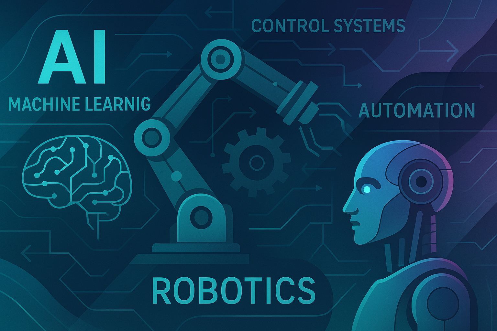

## 💫 About Me:
<h1>Hi, I'm Jeremy Buss</h1> 
I’m a 5th-year Electrical Engineering student at UBC Okanagan with a minor in Computer Science, graduating in May 2027.  🔧 My interests span AI and machine learning, control systems, automation, and robotics. 
I’ve worked on projects ranging from deep learning models for jersey number recognition to automation systems and robotics applications that integrate intelligent decision-making processes. I’m always exploring how to optimize algorithms and develop efficient, real-time solutions for complex systems.  🚀 Whether it's building autonomous systems or experimenting with AI-driven control techniques, I’m excited by the challenge of bringing smart solutions to life.

## 🔨 Current Projects:
- **Jersey Number Recognition:** Enhancing deep learning models for jersey number recognition using low-resolution soccer video tracklets.
- **Ride Matching App:** Developing an app that connects passengers and drivers heading to the same destination, focusing on Java and Android Studio.
- **Robotic Automation System:** Designing and testing automation systems that incorporate real-time decision-making algorithms to optimize control and efficiency.

## 🌐 Socials:
 

# 💻 Tech Stack:
                     
